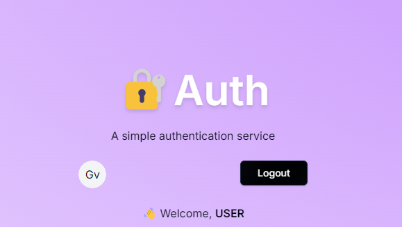

# Welcome! To 👋
    
  
  

# Technologies used 
- next-auth@5.0.0-beta.19
- shadcn ui

# My Learning 
 
  ### Further development
  - reset password 
  - 2FA
  - Manage Account

  ### My Progress 
  - Email verification

  ### TODO's
  - option credentials
  - option magic link 
  - without db 
  
  - Error handel for social and credentials 
  
  ### Get Started

    git clone <repo link>

  Copy the .env.example variables into a separate .env file, fill them out & and that's all you need to get started!
  

# Acknowledgments
[code with antonio](https://www.youtube.com/watch?v=1MTyCvS05V4&list=PLJ2xcbfRupEjkCESVxcDcnMEXkHSHY3Ip&index=22)

# Feedback for me 

# Useful Resources 

## License

[MIT](https://choosealicense.com/licenses/mit/)

## For Developers
    ## The challenge
    ## Clone Repo 
    ## Assets 
    ## Figma file 
    ## Share your project with me 
    ## Need Help from me 

**Have fun  Coding 🚀**
